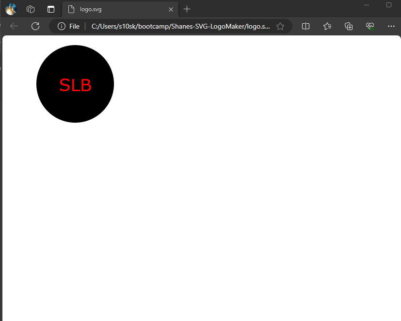

# Shanes-SVG-LogoMaker

## Task 

GIVEN a command-line application that accepts user input
WHEN I am prompted for text
THEN I can enter up to three characters
WHEN I am prompted for the text color
THEN I can enter a color keyword (OR a hexadecimal number)
WHEN I am prompted for a shape
THEN I am presented with a list of shapes to choose from: circle, triangle, and square
WHEN I am prompted for the shape's color
THEN I can enter a color keyword (OR a hexadecimal number)
WHEN I have entered input for all the prompts
THEN an SVG file is created named `logo.svg`
AND the output text "Generated logo.svg" is printed in the command line
WHEN I open the `logo.svg` file in a browser
THEN I am shown a 300x200 pixel image that matches the criteria I entered

## Descrpition 

This is a simple command line interface application that will create a simple logo based 
on input criteria. User can enter up to 3 letters, choose the color of the text and 
background as well as choose between 3 shapes (circle, square, triangle). This will 
create a file called Logo.svg which can be opened in the browser

## Github Repo link

https://github.com/S10skeleton/Shanes-SVG-LogoMaker

## Sample of created Logo

